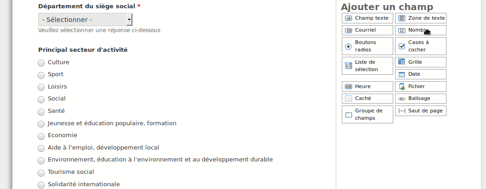

# Framaforms pour YunoHost

[](https://dash.yunohost.org/appci/app/framaforms)    
[](https://install-app.yunohost.org/?app=framaforms)

*[Read this readme in english.](./README.md)*
*[Lire ce readme en français.](./README_fr.md)*

> *Ce package vous permet d'installer Framaforms rapidement et simplement sur un serveur YunoHost.
Si vous n'avez pas YunoHost, regardez [ici](https://yunohost.org/#/install) pour savoir comment l'installer et en profiter.*

## Vue d'ensemble

Framaforms is an online forms and surveys service. Registered users are allowed to create forms, share them, collect and visualize results through a simple interface.
See this [article](https://framablog.org/2016/10/05/framaforms-noffrez-plus-les-reponses-que-vous-collectez-a-google/) and this [interview](https://framablog.org/2016/10/05/en-savoir-un-peu-plus-sur-le-projet-framaforms/) (in French) for further informations.


**Version incluse :** 1.1~ynh1

**Démo :** https://framaforms.org

## Captures d'écran



## Avertissements / informations importantes

## Configuration

You can modify some configurations using the Framaforms administration panel. You can log in with the admin user and the password you gave during installation.

## Documentations et ressources

* Site officiel de l'app : https://framagit.org/framasoft/framaforms
* Documentation officielle de l'admin : https://docs.framasoft.org/fr/framaforms
* Dépôt de code officiel de l'app : https://framagit.org/framasoft/framaforms
* Documentation YunoHost pour cette app : https://yunohost.org/app_framaforms
* Signaler un bug : https://github.com/YunoHost-Apps/framaforms_ynh/issues

## Informations pour les développeurs

Merci de faire vos pull request sur la [branche testing](https://github.com/YunoHost-Apps/framaforms_ynh/tree/testing).

Pour essayer la branche testing, procédez comme suit.
```
sudo yunohost app install https://github.com/YunoHost-Apps/framaforms_ynh/tree/testing --debug
ou
sudo yunohost app upgrade framaforms -u https://github.com/YunoHost-Apps/framaforms_ynh/tree/testing --debug
```

**Plus d'infos sur le packaging d'applications :** https://yunohost.org/packaging_apps